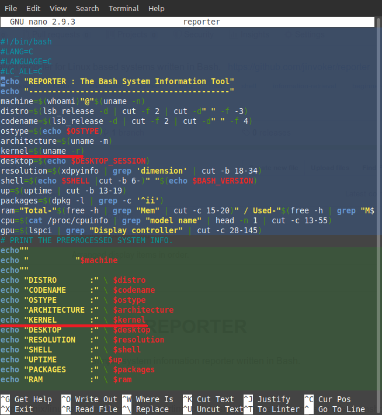

<h1 align="center">REPORTER</h1>
<p align="center">Simple system information reporter written in Bash.</p>
     

[](https://github.com/jinvoker/reporter/blob/master/LICENSE)


<b><i>Reporter</i></b> is a simple Unix/linux system information reporting tool. In simple terms it is serves as a 'screenshot program'. Reporter is aimed to remain simple,fast and minimalistic with merely under 50 lines of code, it is also designed in such a way that the workings are clear to a newbie bash user and to invite more people to join the development.   

Akin to already existing screenshot programs, Reporter borrows aesthetic appeal  from programs such as screenfetch and neofetch, however all of the code is completely written from scratch.


Here’s how reporter looks on Linux Mint:
</a> 


### INSTALLATION
#### How do I install reporter ?

The universal method of getting reporter is cloning the repository and running the file with executable permission. 

1. Clone the repository locally by pasting the following command on the terminal.
```
git clone https://github.com/jinvoker/reporter.git
```
2. Grant executable permissions to file <b><i>reporter</i></b>
```
chmod +x reporter
```
3. Run the program
```
./reporter
```

Additionally create a copy of Reporter in /usr/locale/bin directory to be used universally and on demand by the os.


### WORKINGS
### It's simple !


Understanding what's in the code is essential to know how the code is implemented and also to contribute back in ways, if you would like to.
The picture below might give an overview of the code within. The script is divided and highlighted into two sections, the secion in blue shows the logic of the bash script to be displayed later in the green section. For eg., the  line of code underlined (in red) in the blue section is the same code to be displayed in the green section(underlined in red as well).
</a> 

Comments are placed in areas diffucult to understand. Want to know more about the code here have a look -<a href="https://github.com/jinvoker/reporter/blob/master/reporter">reporter</a>


### CONTRIBUTE
### Like contributing to Free and Open Source software ?
><b><i>" Sharing knowledge is the most fundamental act of friendship. Because it is a way you can give something without loosing something. "</b></i>
                                                                                                               - RMS


### You can contribute :

* Anyone can contribute code.
* Beginners wanting to try a hand at writing bash scripts and want to contribute are welcomed and treated friendly.
* Any tiny bit of help will be appreciated and you will be added to the list of contributors.
* Start by considering this program your own (code released under GPLv2) and make it better.
* Help by adding documentation and fixing whitespaces.
* Send a suggestion.
* Add comments to make the code understandable to others. 
* Raise an issue.
* Want to add a new feature or fix a bug? fork and send your changes through a pull request.


### Contributors

* [List of contributors][contribute]

[contribute]: https://github.com/jinvoker/reporter/graphs/contributors
